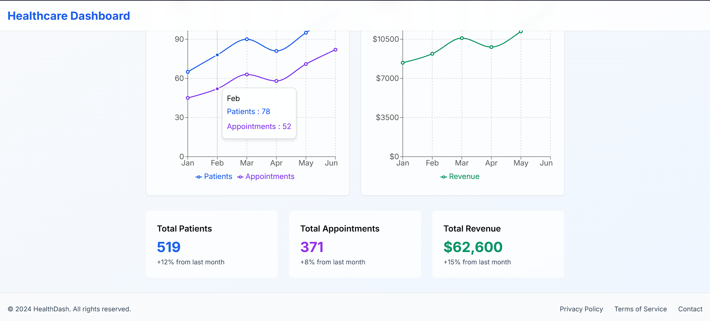
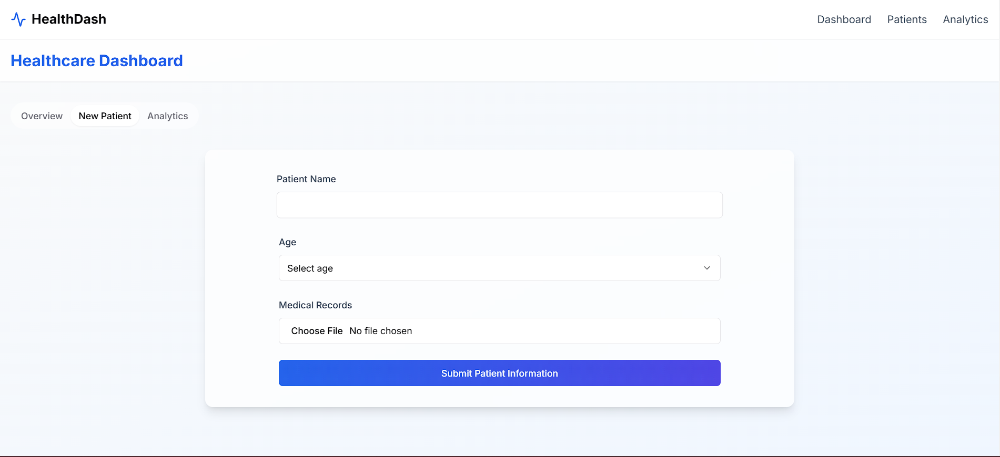

# Modern Healthcare Dashboard 🏥
A sleek and interactive healthcare dashboard built with Next.js, offering real-time analytics, patient management, and comprehensive healthcare metrics visualization.

## 📱 Screenshots
1. Landing Page


2. Analytics Page


3. Patient Management


## 🎥 Demo
[Watch Demo Video](https://youtu.be/PX6JSDVq0SY)

## 🌟 Features
- Real-time patient analytics
- Interactive data visualization
- Patient management system
- Revenue tracking
- Responsive design
- Modern UI/UX
- Animated transitions

## 🛠️ Built With
- **Next.js 14** - React Framework
- **TypeScript** - Type Safety
- **Tailwind CSS** - Styling
- **Shadcn/UI** - UI Components
- **Framer Motion** - Animations
- **Recharts** - Data Visualization
- **Lucide Icons** - Icons
- **React Hook Form** - Form Handling
- **Zod** - Form Validation

## Tools Used
- **Figma** - Design
- **VS Code** - Code Editor
- **Git** - Version Control
- **GitHub** - Code Hosting
- **npm** - Package Manager


## 💻 Getting Started

### Prerequisites

- Node.js 18+ 
- npm/yarn/pnpm

### Installation

1. Clone the repository
```bash
git clone https://github.com/yourusername/healthcare-dashboard.git
```

2. Navigate to the project directory
```bash
cd healthcare-dashboard
```

3. Install dependencies
```bash
npm install
```

4. Start the development server
```bash
npm run dev
```

5. Open your browser and visit `http://localhost:3000`

## 📁 Project Structure
```
healthcare-dashboard/
├── app/
│   ├── dashboard/
│   │   └── page.tsx
│   └── page.tsx
├── components/
│   ├── ui/
│   ├── dashboard/
│   └── layout/
├── lib/
└── styles/
```

## 🔧 Configuration
```bash
{
  "dependencies": {
    "next": "14.x",
    "react": "18.x",
    "framer-motion": "^10.x",
    "recharts": "^2.x",
    "@shadcn/ui": "^0.x"
  }
}
```


## 🤝 Contributing
1. Fork the repository
2. Create your feature branch (`git checkout -b feature/your-feature`)
3. Commit your changes (`git commit -am 'Add some feature'`)
4. Push to the branch (`git push origin feature/your-feature`)
5. Open a pull request
6. Wait for the review and merge


